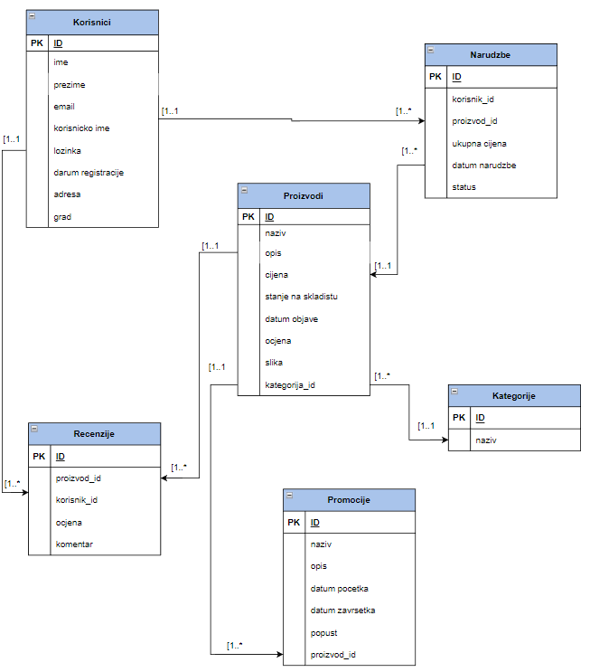

Student

Ivan Jurišić
Diplomski studij informatike, 1. godina
4672/DS
Tema projekta je Game store. Baza podataka se sastoji od 6 tablica, i to:

Kategorije,
Korisnici,
Narudzbe,
Proizvodi,
Promocije.
Recenzije

Korištene tehnologije u ovome projektu su:

Python,
MySql,
Flask,
Kafka,
Redis,
Docker,
JQuery.

U aplikaciji korisnik može naručivati proizvodi,napisati recenziju(može ocjeniti proizvod ili napisati komentar o tome proizvodu),može vidjeti koji je proizvod na popustu,također može vidjeti količinu,stanje na skladištu,datum objave proizvoda.

